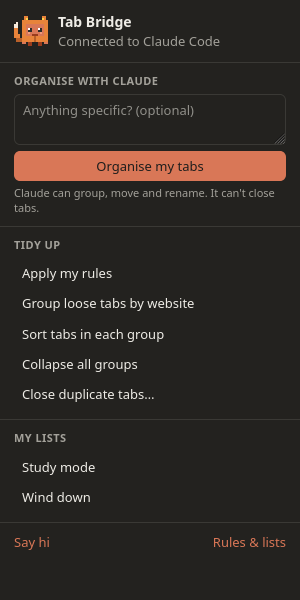
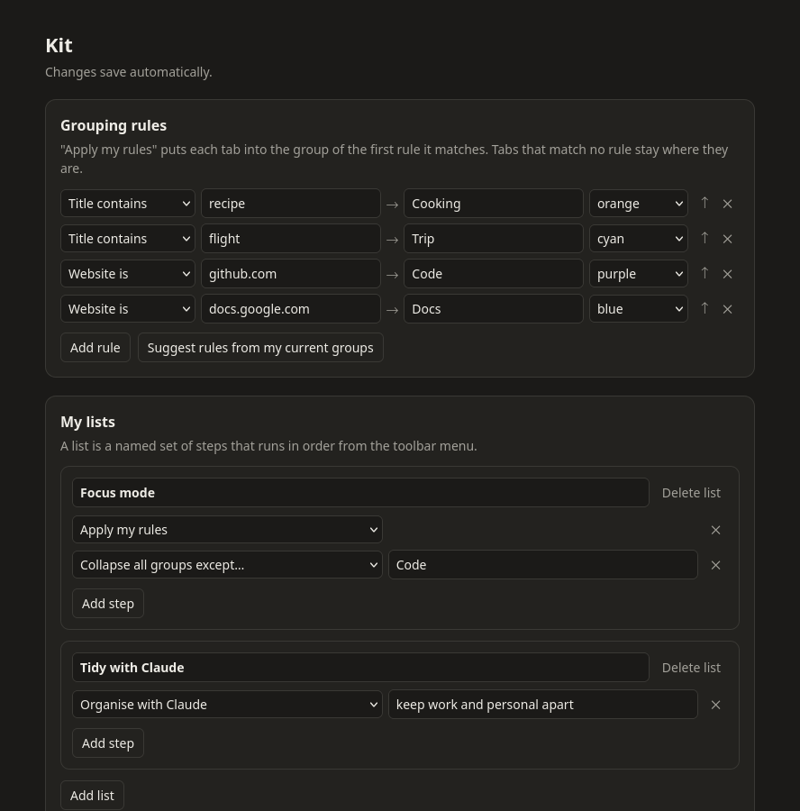
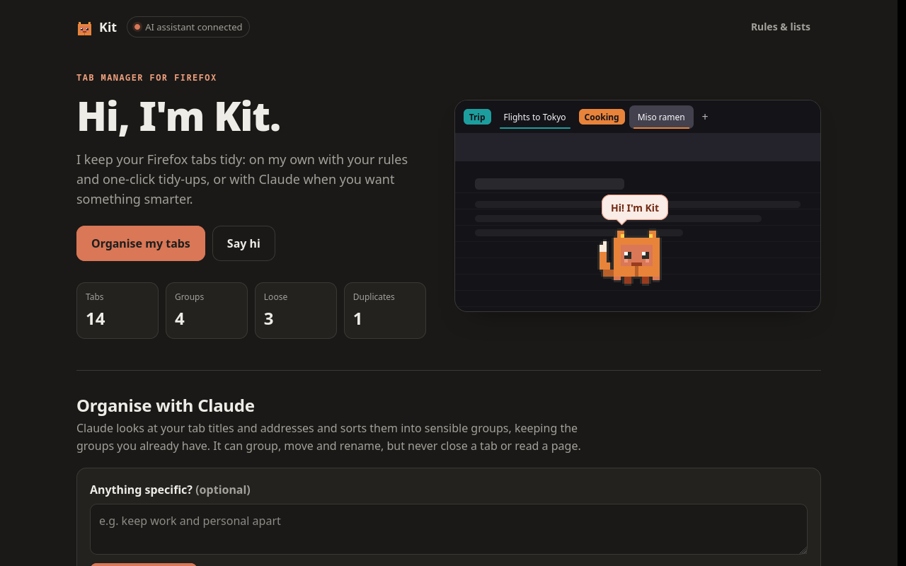
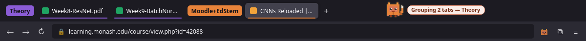
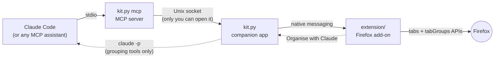

<div align="center">


# Kit

**A Firefox tab manager for Claude Code.**

Let Claude Code list, group, move, switch, close and read your tabs, or tidy up in one click from the toolbar.


<br>


<sub>Kit walks along your tab bar and narrates while tabs change, on every page.</sub>

</div>

---

## Contents

- [Features](#features)
- [Meet Kit](#meet-kit)
- [How it works](#how-it-works)
- [Install](#install)
- [Use it](#use-it)
- [Safety and privacy](#safety-and-privacy)
- [Troubleshooting](#troubleshooting)
- [Development](#development)

## Features

| | |
|---|---|
| 🗂️ **Tabs as tools for Claude** | Claude Code can list your tabs and groups, group and ungroup, rename and recolour groups, move and switch tabs, close tabs, and read a tab's text. |
| ✨ **Organise with Claude** | One button in Firefox asks Claude to sort your tabs into sensible groups, without opening a chat. Add an optional instruction like "keep work and personal apart". |
| 📏 **Your own rules** | "Titles containing *recipe* go in **Cooking**", "github.com goes in **Code**". Apply them in one click, offline and free. Rules can be suggested from the groups you already have. |
| 🧹 **One-click tidy-ups** | Group loose tabs by website, sort tabs within groups, collapse all groups, and close duplicate tabs (after showing you which). |
| 📋 **Action lists** | Chain steps into a named button, like **Focus mode**: apply my rules, then collapse everything except Code. |
| 🦊 **Kit** | A little pixel-art mascot walks along the tab bar and says what's happening. It never changes your theme's colours. |

<table>
  <tr>
    <td align="center" width="34%"><br><sub>The toolbar menu</sub></td>
    <td align="center"><br><sub>Rules and lists</sub></td>
  </tr>
  <tr>
    <td align="center" colspan="2"><br><sub>The full page, with every feature explained</sub></td>
  </tr>
</table>

## Meet Kit



Kit is half Claude, half Firefox: a little Claude-orange creature in a Firefox-orange fox hoodie, complete with hood ears and a bushy tail. Whenever your tabs change, Kit walks in along the tab bar, stops to say what it's doing, then walks off, always facing the way it's going.

Firefox doesn't let extensions draw on the tab bar or on built-in pages, so Kit is drawn as a temporary background on a copy of your current theme. That's why Kit shows up on every page, including `about:` pages and PDFs, why it hops rather than glides, and why your colours never change. If your system is set to reduce motion, Kit appears in place instead of walking.

## How it works



| Part | What it does |
|---|---|
| [`extension/`](extension) | The Firefox add-on. Answers requests with the `tabs` and `tabGroups` APIs, and provides the toolbar menu, settings page and Kit. |
| [`kit.py`](kit.py) | The companion app, one file using only Python's standard library. Firefox starts it when the extension loads; it listens on `$XDG_RUNTIME_DIR/tab-bridge.sock` (mode 600). `kit.py mcp` is the MCP server your AI assistant runs, with the tools `list_tabs`, `list_groups`, `group_tabs`, `ungroup_tabs`, `update_group`, `move_tabs`, `activate_tab`, `close_tabs` and `read_tab`. |
| [`install.sh`](install.sh) | Installs `kit.py` in your home folder, registers it with Firefox and, if it's installed, Claude Code. `--uninstall` removes it all. |

## Install

**1. Add Kit to Firefox** (Firefox 142 or later, any system)

[Install Kit from addons.mozilla.org](https://addons.mozilla.org/firefox/addon/kit-tab-manager/). Rules, lists, the one-click tidy-ups and Kit's walks work straight away; nothing else to install.

**2. Optional: connect your AI assistant** (Linux or macOS)

To let [Claude Code](https://claude.com/claude-code) see your tabs and use **Organise with Claude**, run this once in a terminal:

```bash
curl -fsSL https://raw.githubusercontent.com/samsamthecodingman/kit-tab-manager/master/install.sh | sh
```

It installs Kit's companion app in your home folder (it needs `python3`, which most systems already have), registers it with Firefox, and connects Claude Code if you have it. Kit's menu then says **AI assistant connected**. Run it again any time to update; `sh install.sh --uninstall` removes it.

Other assistants that support MCP can use Kit's tools too: point them at `python3 ~/.local/share/kit/kit.py mcp` (on macOS, `~/Library/Application Support/Kit/kit.py`).

<details>
<summary><b>Installing from a copy of the code instead</b></summary>

```bash
git clone https://github.com/samsamthecodingman/kit-tab-manager.git
cd kit-tab-manager
./install.sh
```

To try the extension from the code, open `about:debugging` → **This Firefox** → **Load Temporary Add-on…** and pick `extension/manifest.json`. Firefox removes it when it restarts.

</details>

## Use it

**From Claude Code**, just ask:

> *Group my trip-planning tabs and collapse the ones I'm not using.*
>
> *Which of my tabs are about Kyoto? Summarise the one with the guesthouse list.*
>
> *Close the duplicate GitHub tabs.*

**From Firefox**, click the Kit button:

- **Organise my tabs** asks Claude to group everything. It takes 20–60 seconds; you can close the menu while it works, and the summary is waiting when you reopen it.
- **Tidy up** runs the one-click actions.
- **My lists** runs your saved action lists.
- **Rules & lists** opens the settings page.
- **Say hi** (top right) brings Kit out without touching any tabs.
- **⤢** (top right) opens Kit's full page, which explains every feature and shows live counts of your tabs, groups and duplicates.

## Safety and privacy

- **No clicking, typing or form submission.** The extension never navigates to new addresses or submits anything.
- **Private windows are invisible** to Kit: their tabs are never listed or read.
- **Page text is data, not instructions.** `read_tab` returns whatever a page says; Claude is told to treat it as untrusted.
- **Closed tabs can be recovered.** They're logged to `~/.local/share/tab-bridge/closed.jsonl`, and Firefox's **History → Recently Closed Tabs** reopens them. Closing duplicates from the menu always shows you the list first.
- **Organise with Claude is fenced in.** It runs `claude -p` (Sonnet) in an empty folder, with no shell, file or web tools and only the grouping tools. It cannot close or read tabs, anything else is refused automatically, and it stops after 5 minutes. Runs are logged to `~/.local/share/tab-bridge/organise.log`.
- **What leaves your machine:** only when you use Claude (from Claude Code or **Organise with Claude**) are tab titles and addresses, and any page text Claude asks to read, sent to Anthropic as part of that conversation. Rules, lists and one-click actions run entirely locally.

## Troubleshooting

| Symptom | Fix |
|---|---|
| Menu says **AI not connected** | That's expected if you haven't run the setup command; Kit's other features still work. If you have, run it again, then reload the extension from `about:addons`. |
| Claude says **Firefox isn't connected** | Make sure Firefox is open and the extension is loaded (a temporary add-on disappears on restart). |
| A tab can't be read | Firefox doesn't let extensions read built-in pages (`about:`, the PDF viewer, addons.mozilla.org). |
| Organise with Claude fails | Check `~/.local/share/tab-bridge/organise.log`; the `detail` field has Claude's error output. |

## Development

```bash
python3 -m pytest -q tests              # companion app and MCP server tests
npx web-ext lint --source-dir extension # check the extension
```

<details>
<summary><b>Releasing a new version</b></summary>

Firefox only installs extensions that Mozilla has signed, and each version is signed once, so bump `version` in `extension/manifest.json` first.

- **Automatically:** push a tag that matches the version, e.g. `git tag v0.6.0 && git push --tags`. The [release workflow](.github/workflows/release.yml) checks the extension and submits it to addons.mozilla.org. It needs the repository secrets `WEB_EXT_API_KEY` and `WEB_EXT_API_SECRET` (from **Developer Hub → Tools → Manage API Keys**).
- **From your computer:** `./sign.sh --listed` submits to addons.mozilla.org, and `./sign.sh` signs a private (unlisted) `.xpi` into `web-ext-artifacts/` instead.

Listing text, screenshots and reviewer notes for addons.mozilla.org are in [`docs/amo-listing.md`](docs/amo-listing.md).

</details>

## License and credits

Kit is released under the [MIT License](LICENSE). See the [privacy policy](PRIVACY.md) for what it does with your data.

Kit is an independent project and isn't made or endorsed by Anthropic or Mozilla. Claude and Claude Code are products of Anthropic; Firefox is a trademark of the Mozilla Foundation.
