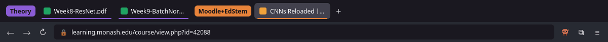
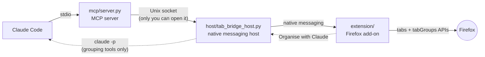

<div align="center">


# Tab Bridge

**Let Claude Code see and organise your Firefox tabs.**

List, group, move, switch, close and read tabs from Claude Code, or tidy up in one click from the toolbar.


<br>



<sub>Pixel walks along your tab bar and narrates while tabs change, on every page.</sub>

</div>

---

## Contents

- [Features](#features)
- [How it works](#how-it-works)
- [Install](#install)
- [Use it](#use-it)
- [Safety and privacy](#safety-and-privacy)
- [Troubleshooting](#troubleshooting)
- [Development](#development)

## Features

| | |
|---|---|
| 🗂️ **Tabs as tools for Claude** | Claude Code can list your tabs and groups, group and ungroup, rename and recolour groups, move and switch tabs, close tabs, and read a tab's text. |
| ✨ **Organise with Claude** | One button in Firefox asks Claude to sort your tabs into sensible groups, without opening a chat. Add an optional instruction like "keep coursework together". |
| 📏 **Your own rules** | "Titles containing *week* go in **Theory**", "edstem.org goes in **Moodle+EdStem**". Apply them in one click, offline and free. Rules can be suggested from the groups you already have. |
| 🧹 **One-click tidy-ups** | Group loose tabs by website, sort tabs within groups, collapse all groups, and close duplicate tabs (after showing you which). |
| 📋 **Action lists** | Chain steps into a named button, like **Study mode**: apply my rules, then collapse everything except Theory. |
| 👾 **Pixel** | A small pixel-art mascot walks along the tab bar and says what's happening. It never changes your theme's colours. |

<table>
  <tr>
    <td align="center" width="34%"><br><sub>The toolbar menu</sub></td>
    <td align="center"><br><sub>Rules and lists</sub></td>
  </tr>
</table>

## How it works



| Part | What it does |
|---|---|
| [`extension/`](extension) | The Firefox add-on. Answers requests with the `tabs` and `tabGroups` APIs, and provides the toolbar menu, settings page and Pixel. |
| [`host/`](host) | The native messaging host. Firefox starts it when the extension loads. It listens on `$XDG_RUNTIME_DIR/tab-bridge.sock` (mode 600) and uses the Python standard library only. |
| [`mcp/server.py`](mcp/server.py) | The MCP server Claude Code runs. Tools: `list_tabs`, `list_groups`, `group_tabs`, `ungroup_tabs`, `update_group`, `move_tabs`, `activate_tab`, `close_tabs`, `read_tab`. |

## Install

You need Firefox 142 or later, [Claude Code](https://claude.com/claude-code), [`uv`](https://docs.astral.sh/uv/) and Python 3.11+.

**1. Register the native host with Firefox**

```bash
./install.sh
```

**2. Register the MCP server with Claude Code**

```bash
claude mcp add --scope user firefox-tabs -- uv run --script "$PWD/mcp/server.py"
```

**3. Install the extension**

- **Signed (permanent):** run [`./sign.sh`](#signing) once to have Mozilla sign it, then open the `.xpi` from `web-ext-artifacts/` in Firefox and click **Add**.
- **Temporary (for development):** open `about:debugging` → **This Firefox** → **Load Temporary Add-on…** and pick `extension/manifest.json`. Firefox removes it when it restarts.

The toolbar button shows **Connected to Claude Code** once everything is in place.

## Use it

**From Claude Code**, just ask:

> *Group my ECE4179 tabs by topic and collapse the ones I'm not using.*
>
> *Which of my tabs are about batch norm? Summarise the open lecture PDF.*
>
> *Close the duplicate Ed Discussion tabs.*

**From Firefox**, click the Tab Bridge button:

- **Organise my tabs** asks Claude to group everything. It takes 20–60 seconds; you can close the menu while it works, and the summary is waiting when you reopen it.
- **Tidy up** runs the one-click actions.
- **My lists** runs your saved action lists.
- **Rules & lists** opens the settings page.
- **Say hi** brings Pixel out without touching any tabs.

## Safety and privacy

- **No clicking, typing or form submission.** The extension never navigates to new addresses or submits anything.
- **Private windows are invisible** to Tab Bridge: their tabs are never listed or read.
- **Page text is data, not instructions.** `read_tab` returns whatever a page says; Claude is told to treat it as untrusted.
- **Closed tabs can be recovered.** They're logged to `~/.local/share/tab-bridge/closed.jsonl`, and Firefox's **History → Recently Closed Tabs** reopens them. Closing duplicates from the menu always shows you the list first.
- **Organise with Claude is fenced in.** It runs `claude -p` (Sonnet) in an empty folder, with no shell, file or web tools and only the grouping tools. It cannot close or read tabs, anything else is refused automatically, and it stops after 5 minutes. Runs are logged to `~/.local/share/tab-bridge/organise.log`.
- **What leaves your machine:** only when you use Claude (from Claude Code or **Organise with Claude**) are tab titles and addresses, and any page text Claude asks to read, sent to Anthropic as part of that conversation. Rules, lists and one-click actions run entirely locally.

## Troubleshooting

| Symptom | Fix |
|---|---|
| Menu says **Bridge not running** | Run `./install.sh` again, then reload the extension. Firefox starts the host only when the extension connects. |
| Claude says **Firefox isn't connected** | Make sure Firefox is open and the extension is loaded (a temporary add-on disappears on restart). |
| A tab can't be read | Firefox doesn't let extensions read built-in pages (`about:`, the PDF viewer, addons.mozilla.org). |
| Organise with Claude fails | Check `~/.local/share/tab-bridge/organise.log`; the `detail` field has Claude's error output. |

## Development

```bash
uv run --with pytest pytest -q tests   # host tests
npx web-ext lint --source-dir extension # check the extension
```

<details>
<summary><b>Signing</b></summary>

Firefox only installs extensions permanently once Mozilla has signed them. Tab Bridge is signed as an **unlisted** add-on: Mozilla reviews it automatically and signs it, but it never appears on addons.mozilla.org.

1. Sign in at [addons.mozilla.org](https://addons.mozilla.org/developers/) and create an API key under **Tools → Manage API Keys**.
2. Run:

   ```bash
   ./sign.sh
   ```

3. Install the `.xpi` it writes to `web-ext-artifacts/`.

Bump `version` in `extension/manifest.json` before signing a new build; Mozilla won't sign the same version twice.

</details>
